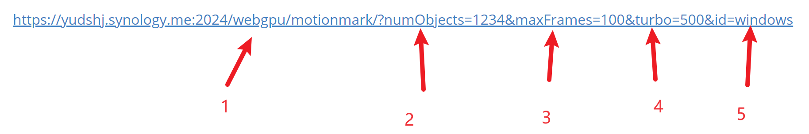

# Yd₂O₃

## WebGL

https://yudshj.synology.me:2024/webgl/motionmark/?numObjects=1234&maxFrames=100&turbo=-1&id=windows

## GL2GPU without turbo

https://yudshj.synology.me:2024/webgpu/motionmark/?numObjects=1234&maxFrames=100&turbo=-1&id=windows

## GL2GPU with turbo

https://yudshj.synology.me:2024/webgpu/motionmark/?numObjects=1234&maxFrames=100&turbo=500&id=windows

php 8.0及以上，设置 `open_basedir` 为 `api/output`.

- 1: 运行模式，webgl=>webgl, webgpu=>gl2gpu
- 2: 渲染物体个数
- 3: 最多捕获多少帧来评估frameTime
- 4: 多少毫秒后开启turbo，设置为<0的数关闭turbo mode
- 5: 实验机器id

参数2~4的位置顺序可以自由更改。

---

https://yudshj.synology.me:2024/webgl/motionmark/?numObjects=500000&maxFrames=100&turbo=-1&id=rambo_laptop_win
https://yudshj.synology.me:2024/webgpu/motionmark/?numObjects=500000&maxFrames=100&turbo=-1&id=rambo_laptop_win
https://yudshj.synology.me:2024/webgpu/motionmark/?numObjects=500000&maxFrames=100&turbo=1000&id=rambo_laptop_win

https://yudshj.synology.me:2024/webgl/aquarium/?numObjects=500000&maxFrames=100&turbo=-1&id=rambo_laptop_win
https://yudshj.synology.me:2024/webgpu/aquarium/?numObjects=500000&maxFrames=100&turbo=-1&id=rambo_laptop_win
https://yudshj.synology.me:2024/webgpu/aquarium/?numObjects=500000&maxFrames=100&turbo=3000&id=rambo_laptop_win

https://yudshj.synology.me:2024/webgl/sprites/?numObjects=100000&maxFrames=100&turbo=-1&id=rambo_laptop_win
https://yudshj.synology.me:2024/webgpu/sprites/?numObjects=100000&maxFrames=100&turbo=-1&id=rambo_laptop_win
https://yudshj.synology.me:2024/webgpu/sprites/?numObjects=100000&maxFrames=100&turbo=3000&id=rambo_laptop_win

