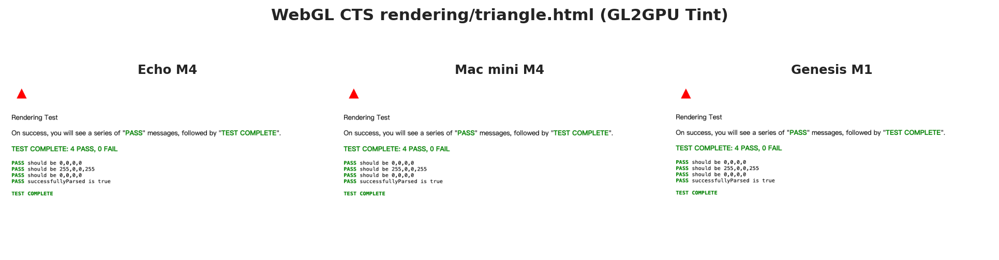
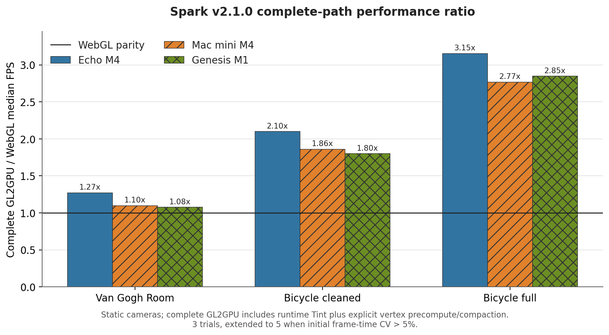
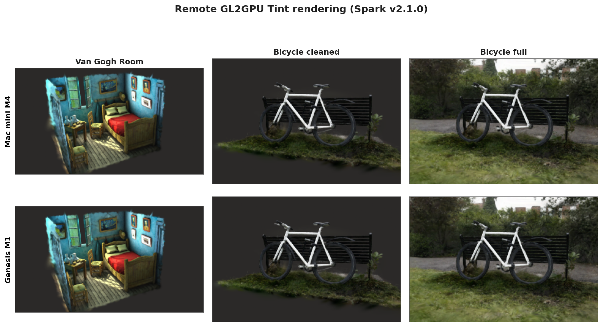
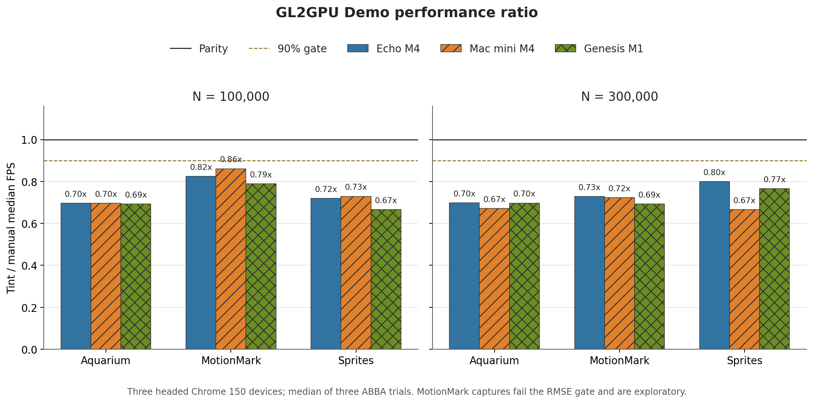

# GL2GPU Tint 三设备正确性与 Spark 性能复现实验

> 实验日期：2026-07-14 至 2026-07-15 
> 报告更新：2026-07-30（与 TOSEM 稿件及证据审计口径同步） 
> 最终实现提交：`8ebfd051751f23a8fa79e43434e8444c9cdd9b0b` 
> Spark 基线标签：`sparkjs-0`（`26e17df5488f4c46af6a86211f615034134f2971`） 
> 浏览器模式：三台设备均为 headed Chrome，`deviceScaleFactor=1`

## 1. 结论

本轮在一台 Apple M4 MacBook Air、一台 Apple M4 Mac mini 和一台 Apple M1
MacBook 上重新运行完整 WebGL CTS，并用同一份 Spark v2.1.0、三份相同哈希的
PLY 场景比较原生 WebGL 与完整 GL2GPU（runtime Tint translation 加显式
precompute/compaction）路径。核心结论如下。

1. **三台设备的初始未修改 CTS 完整运行均为 `2858/2864`。** 六个失败页在三机上
   完全相同。boolean runtime 修复后，只在 Echo M4 对这六页做了 targeted rerun，结果
   为 `4/6`；由此组合得到的 `2862/2864` 不是一次完整实测。
2. **WebGL 2 范围的结果已由完整初始运行和 targeted rerun 共同支持。** 固定 CTS
   中有 1,976 个 WebGL 2 / GLSL ES 3.00 页面（69%）；初始完整运行通过
   `1975/1976`，唯一失败页在 boolean 修复后通过。修复后未重新进行三机完整未修改
   suite 运行，因此该结论必须保留 targeted-rerun 限定。另两页均位于 WebGL 1 范围，
   作为 runtime/fixture 工程跟进项保留，不影响本文的 WebGL 2 范围结论。
3. **本地修改 CTS 后的三机 `2864/2864` 只作为诊断数据。** 这些运行使用 15 份
   report，并验证了修改后输入的完整覆盖；由于测试输入经过本地修改，结果不写成官方
   WebGL conformance pass。初始未修改运行并不是 15-shard 协议。
4. **包含 runtime Tint translation 与静态 precompute/compaction 的完整 GL2GPU 路径，
   steady-state GPU throughput 在三机上都高于原生 WebGL 路径。** Van Gogh Room 为
   `1.076x–1.272x`，cleaned bicycle 为 `1.801x–2.098x`，full bicycle 为
   `2.768x–3.154x`。方向在 M1 与两台 M4 上一致。
5. **上述完整路径的较高 throughput 未伴随本实验画质 gate 失败。** 九组对比的最差
   RMSE 为 `0.0028562`，最低 PSNR 为 `50.884 dB`，最低 SSIM 为 `0.9999133`。两台远程
   机器的代表图已复制回本机逐张目检，没有黑屏、Y 翻转、裁切、丢几何或透明混合异常。
6. **两臂实验不能隔离 Tint 或 precompute/compaction 的增量因果贡献。** GL2GPU arm
   同时包含 runtime translation、pipeline 建立与 benchmark 显式启用的静态相机 splat
   vertex precompute/compaction；没有同一环境下的 generic GL2GPU（无 precompute）arm。
   实现结构表明该路径旨在把部分每帧顶点计算移到加载阶段，但本实验只能报告完整路径
   的端到端差异，不能把观察到的比例归因于 Tint 编译器或单一优化。
7. **通用 Tint/manual 性能仍有缺口，且 MotionMark 只能作探索性结果。** Aquarium
   与 Sprites 通过 RMSE 0.02 gate，Tint 为 manual reference 的 `0.666x–0.729x`
   （100k）和 `0.667x–0.800x`（300k）。MotionMark 的吞吐量也更低，但六组捕获的
   RMSE 为 `0.0458–0.0579`，全部未过 gate；在固定动画/随机状态前不能作为等价工作量
   的正式比较。

## 2. 版本与可复现性

### 2.1 固定版本

| 组件 | 版本或 SHA |
|---|---|
| GL2GPU 最终实现 | `8ebfd051751f23a8fa79e43434e8444c9cdd9b0b` |
| Spark precompute 基线 tag | `sparkjs-0` / `26e17df5488f4c46af6a86211f615034134f2971` |
| GL2GPU release bundle SHA-256 | `8977f67c2856c1f2f4925dc5dd2f77548ed6b4d5cf0e92703a993eabcd58b498` |
| Dawn/Tint source revision | `ab35d6efd17f1b2ba2a6a8f6e89428b26a9c71e6` |
| Tint WASM SHA-256 | `920ce9b2171571556e60afc759bb65e0e6fde55c2946112621ac0b670e4dc4a6` |
| glslang | `@webgpu/glslang@0.0.15` |
| glslang WASM SHA-256 | `dbc5123e1dfef69e4ff360b39a5af1f0b4ebcb59468eb92de9d8ba00635a37a7` |
| WebGL CTS harness SHA-256 | `407a4994bcd3514acec8b9febcb4b1543ee1da42bfa049d93052baeb08838e1b` |
| Spark harness SHA-256 | `24929f9087593322107c1dc3f193bfac89a7c4abffcba09880ab9021618587cf` |
| Khronos WebGL CTS | `064aaf18207438d4f6dd10c98b02b25778257b7f` |
| CTS diagnostic local patch SHA-256 | `846c6bea3331eb426d4c706e07734a16f560d07adf837369ddcb111f8002ca56` |
| Spark | v2.1.0 / `f22236f95fdd8078f0c12e3aab479523d401daf6` |

实验在实现 commit 创建前运行，因此原始 JSON 的 `gl2gpuCommit` 字段记录的是当时的
基线 `26e17df`。实验后没有再修改受测 runtime 与 harness，而是将同一棵实现树提交为
`8ebfd05`。后期 diagnostic CTS 与 Spark 输出记录了上表的 bundle/harness 哈希；初始
未修改 CTS 输出没有自包含后来补齐的全部身份字段。因此实验身份以已保留文件的 SHA-256、
实现 commit 和后期 harness 记录共同界定，不把旧 JSON 中的单一 commit 字段泛化为完整
远端工作树证明。

### 2.2 设备

| 设备 | SoC / GPU | 内存 | macOS | Chrome |
|---|---|---:|---|---|
| Echo M4 | Apple M4，10-core GPU | 32 GiB | 26.3.1 (25D771280a) | 150.0.7871.115 |
| Mac mini M4 | Apple M4，10-core GPU | 16 GiB | 26.2 (25C56) | 150.0.7871.124 |
| Genesis M1 | Apple M1，8-core GPU | 16 GiB | 26.2 (25C56) | 150.0.7871.102 |

三台机器都连接在线桌面会话并启动可见 Chrome 窗口，不使用 headless Chrome。Chrome
主版本一致，但 patch version 不完全一致，因此小于几个百分点的跨机差异不应解释成
硬件因果关系。

## 3. WebGL CTS

### 3.1 Runtime 修复

先前的完整三机运行均为 `2858/2864`，六个失败集合完全相同。其中四个用例涉及
boolean uniform 的默认值、跨 program 状态和 bool/int/float cast：

- `conformance/glsl/bugs/bool-type-cast-bug-int-float.html`
- `conformance/uniforms/uniform-default-values.html`
- `conformance/uniforms/uniform-values-per-program.html`
- `conformance2/glsl3/bool-type-cast-bug-uint-ivec-uvec.html`

根因不是 Tint 的 GLSL 解析，而是 GL2GPU 在 link 后把选定的 boolean uniform
lower 成 WGSL pipeline override。这个优化默认开启时，把 WebGL 的“每个 program
拥有独立、可变且有规范默认值的 uniform 状态”压缩成 pipeline variant 状态，导致
默认值和 program 切换语义不再可靠。`8ebfd05` 将该优化改成只有
`__HYD_STATIC_BOOLEAN_UNIFORM_VARIANTS === true` 时才启用。生产默认路径保留普通
uniform 读取；上述四个定向用例随即恢复通过。

Echo M4 随后只对最初的六个失败页运行未修改的 CTS，实测为 `4/6`。因此该阶段仍有
两个 WebGL 1 identifier 相关页面需要后续工程处理；它既不是完整 suite rerun，也不能
表述为实测 `2862/2864`。报告只保留这两页对证据阶段的影响。

### 3.2 三阶段证据与 WebGL 1/2 范围

初始未修改运行的分块方式与后期 diagnostic 不同：Echo M4 和 Mac mini M4 各由一个
prefix block 加三个 range block 合并，Genesis M1 使用三个 shards。逐页汇总仍在三机
上分别得到 2,864 个唯一页面、零 timeout，且失败集合完全相同。只有后期本地修改输入
的完整 diagnostic 使用每机 15 份 report。

| 阶段 | 范围 | 结果 | 证据含义 |
|---|---|---:|---|
| 原始 runtime，未修改 CTS | 三机完整运行 | 每机 2,858/2,864 | 正式初始证据；六页失败集合相同 |
| Boolean 修复，未修改 CTS | Echo M4 原六页 targeted rerun | 4/6 | 验证四项 runtime 修复；不是完整 suite |
| Boolean 修复，本地修改 CTS | 三机完整 diagnostic | 每机 2,864/2,864 | 仅验证修改后输入与 harness；不作为 conformance pass |

固定 CTS 的 2,864 个页面中，1,976 个（69%）属于 WebGL 2 / GLSL ES 3.00 范围。
唯一的 WebGL 2 初始失败页属于四个已修复的 boolean 用例，并在 Echo targeted rerun
中通过。因而“1,976 个 WebGL 2 页面全部通过”由三机初始完整运行加 targeted evidence
共同支持，而不是一次 post-fix 三机完整重跑。

| Suite 范围 | 页面数 | 初始失败 | Boolean 修复后剩余 |
|---|---:|---:|---:|
| WebGL 1：`conformance/` | 888 | 5 | 2（targeted；完整未修改重跑待做） |
| WebGL 2：`conformance2/` + `deqp/gles3/` | 1,976 | 1 | 0（targeted；完整未修改重跑待做） |

### 3.3 本地补丁诊断汇总（非 conformance result）

| 设备 | 分块 | 唯一页面 | 通过 | 失败 | Timeout | 重复 | 完整 | Conformance eligible |
|---|---:|---:|---:|---:|---:|---:|---|---|
| Echo M4 | 15 | 2864 | 2864 | 0 | 0 | 0 | 是 | **否** |
| Mac mini M4 | 15 | 2864 | 2864 | 0 | 0 | 0 | 是 | **否** |
| Genesis M1 | 15 | 2864 | 2864 | 0 | 0 | 0 | 是 | **否** |

三机本地补丁汇总仍验证 CTS commit、fixture diff SHA、bundle SHA 和 harness SHA 全部
一致，因而可用于复现与诊断；由于运行输入经过本地修改，其中的 `2864/2864` 不用于
官方 conformance-pass 声明。
下图是三台远程/本地 headed Chrome 对 `rendering/triangle.html` 的实际截图；每张都显示
红色三角形和 `4 PASS, 0 FAIL`，仅证明该页面的运行与截图链路。

## 4. Spark v2.1.0 实验方法

### 4.1 场景与相机

| Scene | 文件大小 | Camera | PLY SHA-256 |
|---|---:|---|---|
| Van Gogh Room | 23,208,408 B | `cameras_test.json[0]` | `3c52f6f…e7f5` |
| Bicycle cleaned | 263,648,100 B | `cameras_test.json[0]` | `b62d9502…8641` |
| Bicycle full | 1,520,726,124 B | `cameras_test.json[0]` | `64d357cb…227` |

实验记录声明三台机器使用相同的场景 SHA-256；本次证据审计重新核对了当前本地 PLY
文件的大小与哈希，但没有保留可独立复核的逐机远端验证日志。相机按 WebSplatter 的
OpenCV column convention 解释；canvas backing resolution 使用 camera 原始尺寸的
1/4。相机选择、viewport、场景文件和 Spark module 在两个实验臂中完全相同。

### 4.2 测量协议

- 两个实验臂分别是原生 Spark WebGL，以及包含 GL2GPU runtime Tint translation 和
  benchmark 显式 vertex precompute/compaction 的完整 GL2GPU 路径；两者不是只改变
  shader translator 的编译器 A/B。
- GL2GPU 路径必须满足 `shaderDbRequests=0`、无 page error、无 WebGPU validation error、
  无 shader translation failure，并确认 vertex precompute hook 实际 applied。
- 每个 trial 先做 2 个 warmup batch，再做 9 个 measurement batch，每 batch 2 帧；
  指标等待 GPU 完成，不受显示器 60 Hz RAF 上限限制。
- 每个 scene/mode 先按 ABBA 顺序运行 3 次。若任一 mode 前三次 median frame time 的
  coefficient of variation 大于 5%，两边都扩展至 5 次。
- 三台设备的 room 与 cleaned bicycle 都扩展到 5 次；full bicycle 前三次已稳定，
  按协议保留 3 次。表中使用有效 trial median 的 median。
- 画质对每对同相机截图计算 normalized RMSE、PSNR 和 SSIM；RMSE gate 为 0.02。

M4 首次 preflight 的页面已经完成渲染，但非登录 SSH PATH 中找不到已安装的
`/opt/homebrew/bin/magick`，截图分析返回 `spawnSync magick ENOENT`。该轮被严格标为
invalid 并全部丢弃；补齐 PATH 后从头重跑，以下只使用第二轮有效结果。

## 5. Spark 性能结果

### 5.1 Steady-state throughput

| 设备 | Scene | Trials/模式 | WebGL FPS | GL2GPU 完整路径 FPS | 完整路径/WebGL | Frame time 差异 | 完整路径/WebGL load |
|---|---|---:|---:|---:|---:|---:|---:|
| Echo M4 | Van Gogh Room | 5 | 106.952 | 136.008 | 1.272x | 21.4% | 3.76x |
| Echo M4 | Bicycle cleaned | 5 | 103.950 | 218.103 | 2.098x | 52.3% | 1.84x |
| Echo M4 | Bicycle full | 3 | 32.946 | 103.896 | 3.154x | 68.3% | 1.17x |
| Mac mini M4 | Van Gogh Room | 5 | 119.868 | 131.536 | 1.097x | 8.9% | 4.08x |
| Mac mini M4 | Bicycle cleaned | 5 | 105.597 | 196.367 | 1.860x | 46.2% | 1.92x |
| Mac mini M4 | Bicycle full | 3 | 33.239 | 92.017 | 2.768x | 63.9% | 1.12x |
| Genesis M1 | Van Gogh Room | 5 | 120.012 | 129.074 | 1.076x | 7.0% | 3.64x |
| Genesis M1 | Bicycle cleaned | 5 | 88.790 | 159.936 | 1.801x | 44.5% | 1.82x |
| Genesis M1 | Bicycle full | 3 | 25.947 | 73.842 | 2.846x | 64.9% | 1.16x |

在本次三个场景的两臂数据中，场景越大，完整 GL2GPU 路径与原生 WebGL 的 throughput
比值越高。Full bicycle 的原生 WebGL median frame time 为 `30.1–38.5 ms`，完整路径为
`9.6–13.5 ms`；Van Gogh Room 的比值为 `1.076x–1.272x`。这是有限场景上的描述性趋势，
并未通过 generic GL2GPU（无 precompute）arm 隔离其原因。

完整 GL2GPU 路径的加载时间也更长。其相对原生 WebGL 的 median load-time ratio 为 room 的
`3.64x–4.08x`、cleaned bicycle 的 `1.82x–1.92x`、full bicycle 的 `1.12x–1.17x`。
完整路径在这一阶段包含 WGSL translation、pipeline creation、compute precompute、
visible-index readback 和 compact buffer 建立；当前数据没有逐项拆分这些成本。静态
观看时间越长，steady-state 差异越有机会摊薄额外加载时间；频繁变化的相机或数据不能
直接套用本表。

### 5.2 路径差异与候选机制

原生 Spark vertex shader 每帧、每个实例都要从 ordering/splat textures 读取数据，
计算 clip center、2D covariance eigenvectors、屏幕空间 axes、alpha/标准差和最终 quad
offset。GL2GPU 的显式 precompute 路径做了三件事：

1. 把可复用的每实例计算搬到一次 compute dispatch，写入四个 storage buffer；
2. 读取 adjusted-stddev 可见性结果，生成 visible index 列表并在 GPU 上 compact；
3. render pipeline 只消费 compact 后的 clip/axes/RGBA/stddev instance attributes，
   每个 quad vertex 仅完成少量插值与位置重建。

从代码结构看，这条路径旨在同时减少“参与 draw 的 instance 数”和“每个可见 instance
的重复顶点计算”。但本次两臂实验没有在同一环境测量 generic GL2GPU（无 precompute）
arm，因而不能把完整路径的 throughput 比值定量归因于上述任一环节。该优化由 Spark
shader 结构触发并由 benchmark 显式调用，不是 Tint WASM 对任意 GLSL 自动执行的通用
pass，也不能作为 Dawn/Tint compiler speedup 的证据。

## 6. 画质与视觉检查

| Scene | 三机 RMSE 范围 | PSNR 范围 (dB) | SSIM 范围 |
|---|---:|---:|---:|
| Van Gogh Room | 0.0005660–0.0005671 | 64.926–64.944 | 0.9999967–0.9999967 |
| Bicycle cleaned | 0.0010225–0.0010227 | 59.805–59.807 | 0.9999607–0.9999607 |
| Bicycle full | 0.0028559–0.0028562 | 50.884–50.885 | 0.9999133–0.9999133 |

所有 RMSE 都远低于 0.02 gate。指标之外，两台远程机器的完整 GL2GPU 路径代表图和对应 WebGL
图均以 original resolution 逐张查看：房间的床、墙面、窗户和地板完整；cleaned
bicycle 保留暗背景与局部地面；full bicycle 的真实背景、车架、长椅和前景草地一致。
没有出现此前 texture-coordinate bug 所造成的 Y 翻转。

## 7. 与 manual GL2GPU 的关系

本轮 Spark 没有 manual shader reference，因此不能从 Spark 表直接回答“TINT WGSL 是否
已经追平手写 WGSL”。同一批机器在 2026-07-14 对 GL2GPU Demo 的 headed Chrome 150
结果提供了独立背景。每个 mode 运行 3 个 ABBA 交错 trial，预热 30 帧后汇总 120 帧，
预设 normalized RMSE gate 为 0.02：

| Workload | Aquarium Tint/manual | MotionMark Tint/manual | Sprites Tint/manual |
|---|---:|---:|---:|
| 100,000 objects（三机范围） | 0.693x–0.697x | 0.788x–0.861x | 0.666x–0.729x |
| 300,000 objects（三机范围） | 0.671x–0.697x | 0.693x–0.728x | 0.667x–0.800x |

| Workload | 三机、两规模 RMSE 范围 | 图像 gate |
|---|---:|---:|
| Aquarium | 0.001140–0.001649 | Pass |
| MotionMark | 0.045785–0.057940 | **Fail / exploratory** |
| Sprites | 0.001226–0.001265 | Pass |

MotionMark harness 未记录两个浏览器进程之间共同的动画/随机状态 checkpoint，因此当前
捕获不能区分 phase variation 与真正渲染差异。其 timing 为透明起见保留，但不进入正式的
等价输出结论。

所以最终判断分三层：

- **WebGL 语义证据：** 初始未修改 CTS 完整运行是 2,858/2,864；boolean runtime
  修复后，Echo M4 对六页 targeted 复测为 4/6。固定 CTS 中 1,976 个 WebGL 2 页面由
  初始完整运行和 targeted rerun 共同支持为全部通过，但尚未进行 post-fix 三机完整
  未修改重跑。本地修改输入后的三机 2,864/2,864 只作为诊断记录。
- **Spark 特定静态 workload：** 包含 runtime Tint translation 与显式
  precompute/compaction 的完整 GL2GPU 路径在所测三机、三场景上通过画质 gate，且
  throughput 高于原生 WebGL；两臂设计不能隔离 Tint 或 precompute 的增量因果贡献。
- **通用 Tint shader 性能：** 通过图像 gate 的 Aquarium/Sprites 尚未追平 manual
  reference；仍需继续做通用 WGSL/IR、pipeline/state 与 API submit 成本分析。

## 8. TOSEM 期刊扩展：相对 WWW’25 新增了什么

比较基线是 WWW’25 **实际提交**的论文内容：会议稿 `main.tex` 没有纳入单独的
`sections/5-discussion.tex`，但纳入了 `appendix-discussion.tex` 中的 generalizability
与 limitations。因此，TOSEM 的 Discussion 包含新的失效分析、性能决策模型和
API-migration 启示，但不能把所有泛化与局限讨论都描述成从无到有。

按当前源文件运行 `texcount -sum -inc -brief`，WWW’25 实际提交内容为 7,544 词，
TOSEM 稿为 11,969 词，增加 4,425 词（约 58.66%）。篇幅只是扩展规模的旁证；核心
研究增量是系统边界、语义兼容层、研究问题和证据方法的变化。

### 8.1 保留内容与实质新增

| 维度 | WWW’25 实际提交版 | TOSEM 期刊扩展 |
|---|---|---|
| 核心 API 架构 | JavaScript prototype interception、WebGL 状态模拟、两级缓存、uniform batching 和 render-bundle Trie | 保留并精炼这些机制；新增 `Program-Aware Shader Handoff`，把原架构连接到运行时编译器 |
| Shader 系统边界 | 有限 shader 集合；提前准备 WGSL，运行时按 GLSL 源码查表 | 数据库无关的运行时链路：WebGL validation → glslang → SPIR-V → vendored Tint/WASM → WGSL normalization → WebGPU module |
| Program 与语义兼容 | 合并预制 WGSL 的共享变量，主要覆盖三个 benchmark 所需路径 | 新增 program-wide layout，以及 stage interface、uniform/block、sampler/texture、integer sampling、row-major、纹理坐标 provenance、framebuffer/copy/pass、robustness、错误传播与 shader capture |
| 正确性证据 | 三个 benchmark 的像素差异检查 | 新增固定 CTS 的三机完整运行、定向修复验证、WebGL 1/2 scope 分析，并把本地修改输入的满分运行明确排除在 conformance claim 之外 |
| 通用路径性能 | 没有测 runtime compiler 相对 manual WGSL 的代价 | 新增 runtime Tint 与 manual-WGSL reference 的对照；只有通过 RMSE 0.02 gate 的 workload 进入确认性结论 |
| 真实应用案例 | MotionMark、JSGameBench、Aquarium | 新增 World Labs Spark v2.1.0 三场景、三设备案例，分别报告 throughput、load time 和图像质量 |
| 研究解释 | 重点是性能改善与 cache/uniform/bundle ablation | 新增 RQ 式组织、有效性威胁、break-even 模型和证据边界；Spark 两臂结果不归因于 Tint 或 precompute 单项 |
| 可复现性 | 会议实现与 benchmark 信息 | 新增 implementation、bundle、Tint、glslang、CTS、diagnostic diff、harness 和 Spark 的 revision/SHA-256，以及机器可读 summary |

会议版在十台 macOS、Windows 和 Android 设备上报告的 45.05% mean frame-time
reduction，以及 cache、uniform batching 和 render-bundle ablation，仍属于原
manual-shader path 的历史证据。TOSEM 附录将其单独保留，不与 Chrome 150 的
runtime-compiler 实验合并。

### 8.2 新增证据回答的三个问题

1. **RQ1，语义兼容：** 初始未修改 CTS 的三机完整运行均为 2,858/2,864；
   Boolean-uniform 修复后，Echo M4 对原六页定向复测为 4/6。1,976 个 WebGL 2 /
   GLSL ES 3.00 页面由完整初始运行和定向证据共同支持为全部通过，但尚未进行修复后
   三机完整未修改重跑。剩余 legacy WebGL 1 项属于工程跟进，不作为期刊研究贡献。
2. **RQ2，生成路径成本：** 通过图像 gate 的 Aquarium 与 Sprites 中，runtime Tint
   达到 manual reference 的 0.666x-0.729x（100k）和 0.667x-0.800x（300k）。
   MotionMark 因图像 gate 失败，只保留为探索性 timing。
3. **RQ3，应用价值：** Spark 完整 GL2GPU arm 同时包含 runtime Tint 和显式静态相机
   precompute/compaction；九个设备/场景单元为 native WebGL throughput 的
   1.076x-3.154x，load-time ratio 为 1.12x-4.08x，九组图像均通过 RMSE 0.02 gate。
   该设计测量完整配置，不能估计 Tint 或 precompute 的独立因果贡献。

## 9. TOSEM 稿件阅读与审阅指南

主稿位于
`/Volumes/Code/gl2gpu-tint-transaction/TOSEM-GL2GPU/main.tex`，是单一扁平文件。
下面的行号基于本报告更新时的版本；建议分四轮阅读。

### 9.1 第一轮：先确认论文承诺什么

- **Abstract（约第 77-93 行）与 Introduction（第 97-144 行）：** 先抓住从
  prepared-shader 性能原型到 runtime compilation + conformance 的研究边界变化。
- **Contributions 与 Relationship to the Conference Paper（第 121-143 行）：**
  核对每项 novelty 是否在后文有实现和实验对应。
- **Conclusion（第 1,039-1,054 行）：** 反向检查结论是否严格回收到三个 RQ，
  是否保留了 CTS、MotionMark、Spark 因果归因和平台范围的限定。

### 9.2 第二轮：只读期刊新增的技术核心

1. 先用 **Program-Aware Shader Handoff**（第 208-213 行）理解会议 API 架构和新编译器
   的连接点；`API Translation Architecture` 其余内容（第 184-308 行）主要继承并精炼
   WWW’25，不宜重复申报为全新机制。
2. 精读 **Runtime Shader Translation**（第 309-424 行）。沿 pipeline 与 algorithm
   检查 validation、program layout、glslang、SPIR-V、Tint/WASM、WGSL normalization、
   cache identity、diagnostics 和 database elimination 是否闭环。
3. 精读 **Semantic Compatibility Layer**（第 425-495 行）。先看 compatibility table，
   再检查 stage IO、uniform、sampler/texture、coordinate provenance、framebuffer/pass、
   robustness 与 observability 是否分别有实现依据。

### 9.3 第三轮：按证据类型审阅 Evaluation

`Evaluation` 位于第 496-956 行。不要把三类结果汇总成一个“GL2GPU 平均提升”：

- **RQ1 / CTS（第 572-718 行）：** 区分初始完整运行、修复后 targeted rerun 和
  local-patch diagnostic full run；重点检查每个数字是否对应正确的 evidence stage。
- **RQ2 / Runtime Tint vs manual reference（第 719-783 行）：** 先看图像 gate，再看
  throughput；MotionMark 不进入等价输出的确认性结论。
- **RQ3 / Spark（第 784-911 行）：** 把完整 GL2GPU arm 理解为 runtime Tint 加显式
  precompute/compaction；同时阅读 throughput、load-time 与 fidelity，避免单因素归因。
- **Threats to Validity（第 912-956 行）：** 重点核对缺少同环境 Spark 第三臂、
  Apple Silicon + Chrome 150 范围、静态相机和试验次数限制。

### 9.4 第四轮：判断论文是否达到期刊扩展标准

- **Discussion（第 957-1,009 行）：** `Correctness Before Optimization`、
  `A Performance Decision Model`、`Why Spark Is Both Useful and Limited` 与
  `Implications for API-Migration Research` 是新增分析；`Generalizability` 和
  `Open Limitations` 是对 WWW’25 已提交附录讨论的扩写。
- **Related Work（第 1,010-1,038 行）：** 检查是否已经从单纯 WebGPU/API mapping
  扩展到 API virtualization、shader translation、WebGPU systems/security 与
  conformance engineering，并清楚声明 conference-to-journal 关系。
- **Artifact appendix（第 1,055-1,085 行）：** 用 revision/SHA-256 与
  `TOSEM-GL2GPU/evidence-audit/2026-07-30/` 交叉核对新实验。
- **Historical-evidence appendix（第 1,086-1,092 行）：** 确认旧会议结果只是历史
  对照，没有与新实验混算。

最终审阅时建议逐项回答：继承机制与新增机制是否分清；每项贡献是否有代码或数据支撑；
每个结果是否标明完整、定向、诊断或探索性证据；Spark 是否始终写成完整配置结果；
结论是否超出 Apple Silicon、Chrome 150、静态相机和当前 workload 的有效范围。

## 10. 限制与后续工作

1. 三机 Chrome 150 的 patch version 不同，小幅跨机差异不具备严格的硬件归因能力。
2. Spark 使用固定相机。相机、sorting textures 或 splat 数据变化后需要重新 precompute；
   本轮没有测量动态相机下的重新计算频率与 amortized cost。
3. PLY load time 包含磁盘、解析、GLSL→SPIR-V→WGSL、pipeline 和 precompute 多类成本；
   当前只报告端到端 load ratio，没有把它们逐项拆分。
4. Full bicycle 的性能稳定到只需 3 次，轻场景扩展到 5 次；这足以支持当前 7%–215%
   的差异方向，但不适合声明 1%–3% 的微优化。
5. 下一轮通用性能工作应以 Aquarium、MotionMark、Sprites 的 manual shader 为
   teacher，分解 Tint WGSL 的每像素 ALU、texture LOD、local store/load、pipeline
   variant 和 CPU submit 开销，并继续用三机画质 gate 做 A/B。
6. MotionMark 需要固定动画/随机状态后重跑；Spark 需要同一 Chrome 150 环境下成功的
   generic GL2GPU（无 precompute）arm。早期 Genesis M1/Chrome 148 preflight 在 120 秒
   timeout 后 renderer crash，不能作为正式 ablation。
7. 当前结果限于 Apple Silicon、Chrome 150 和静态相机；需要在其他 GPU/后端以及动态
   相机或数据更新频率下复现，才能判断收益的可迁移性与摊销边界。
8. Tint build script 固定了 CMake/Emscripten flags，但当时的 Emscripten 版本未记录；
   当前以 vendored WASM hash 作为实验身份，bit-for-bit source rebuild 仍待验证。
9. 远端 Spark checkout 和逐机 PLY 哈希日志没有形成完整的密码学证据链；这些缺口不
   改变已保留 JSON 的数值复算结果，但限制第三方对远端环境身份的逐字节复现。

## 11. 结果索引

本报告包内可移植、经过校验的精简数据：

- `data/three-device-experiment-summary.json`
- `data/demo-tint-manual-summary.json`
- `data/cts-evidence-stages.json`
- `data/cts-webgl2-scope.json`
- `data/compiler-provenance.json`
- `data/spark-generic-preflight.json`
- `assets/cts-triangle-three-device.png`
- `assets/spark-tint-webgl-ratios.{png,svg}`
- `assets/spark-remote-rendering-montage.png`
- `assets/demo-tint-manual-ratios.{png,svg}`

完整原始结果位于 `/Volumes/Code/gl2gpu-tint/output/`，不在本报告包中重复保存。关键路径：

- `output/multidevice-20260714/local/cts/results.json`
- `output/multidevice-20260714/mac-mini-m4/cts/results.json`
- `output/multidevice-20260714/genesis-m1/cts-chrome150/results.json`
- `output/webgl-cts-20260715-targeted-post-fix/summary.json`
- `output/webgl-cts-20260715-local-serial/summary.json`
- `output/multidevice-20260715/{local,mac-mini-m4,genesis-m1}/spark-requested-scenes/`
- `output/multidevice-20260714/`（GL2GPU Demo Tint/manual 背景实验）

报告数据生成器会重新验证三机本地修改 CTS 的诊断性 `2864/2864` 计数、实际 trial
扩展规则、Spark 质量 gate、`shaderDbRequests=0` 和 vertex precompute applied 状态。
这一检查只验证修改后输入的数据一致性；初始未修改运行和 targeted rerun 的证据阶段
由单独的 `cts-evidence-stages.json` 保存。任何生成器数据条件不满足都会以非零状态退出。
